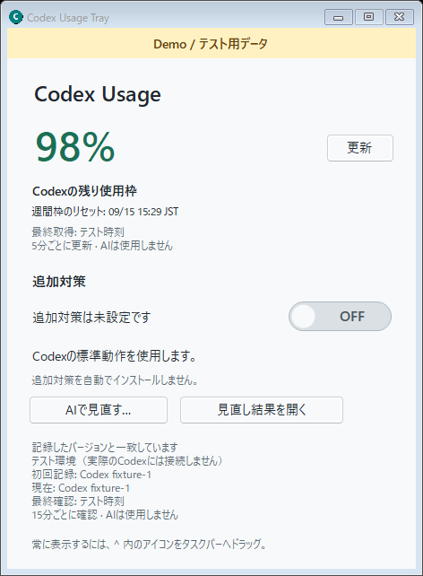
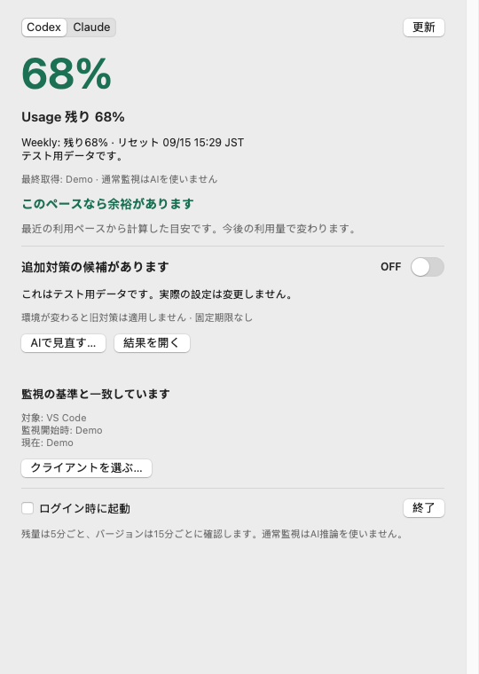

# Codex Usage Tray

[日本語](README.ja.md) · [Windows + Mac downloads](https://github.com/zeusu-sato/codex-usage-tray/releases/tag/v0.4.0) · [Privacy](docs/PRIVACY.md)

An unofficial Windows system-tray and macOS menu-bar app that keeps your reported Codex and Claude Code allowance in view. Hover over its number and gauge for the remaining percentage and reset time; open the window for quota details, client versions, and optional instructions you can review and switch on yourself.

**v0.4.0 is an early beta for Windows x64 and macOS 13+ (Apple Silicon / Intel). The interface is currently Japanese.** This project is independent of OpenAI and Anthropic.



Demo screenshot using test data, not real accounts. Captured from the native UI with [capture-dual-demo.ps1](windows/capture-dual-demo.ps1).

## Codex + Claude

**v0.3.0 adds experimental Claude Code support**, two tray icons, and a shared window. The existing Codex features remain available.

- Two tray icons share one window with Codex and Claude tabs. Clicking an icon opens its tab. Each provider keeps its own client selection, quota history, review records, and instruction switch.
- Provider symbols are read from your installed official VS Code / Insiders extensions and drawn behind the number at **18% opacity**. Symbols are not bundled; without a usable local image, the icon shows only the number and gauge.
- Claude metadata support is experimental and restricted to **Claude Code 2.1.263**. It uses the installed CLI's internal `initialize` / `get_usage` control interface with behaviors disabled, never a prompt. Other versions stop before the metadata session starts; unsupported responses remain unknown. This is not a stable public API compatibility promise.
- Claude's number covers only the global **five-hour and weekly** windows. Both must be supplied. Model-specific limits and extra usage are excluded, so this does not establish availability for every model. A null reset time keeps the known percentage but cannot support a forecast for that window.
- A local random salt and HMAC-SHA256 identify account continuity without retaining raw email, organization, or account names. The salt, pseudonymous scope, and bounded quota history stay in the provider's local cache. Missing identity prevents a forecast; account changes restart history. See [Privacy](docs/PRIVACY.md).
- Routine quota/version checks and arithmetic forecasts perform **no AI inference**. An explicitly approved Claude **AI review uses Codex**, consuming Codex allowance only after **Yes**. It follows the model selection and maximum supported reasoning rules below; ambiguous selection requires a choice before inference.

Claude monitoring requires an existing Claude Code installation and login. Reviewing Claude additionally requires Codex. A separately enabled Claude proposal writes its guarded block to global `CLAUDE.md` under `%USERPROFILE%\.claude` (or `CLAUDE_CONFIG_DIR`); Codex proposals continue to use `AGENTS.md`. Neither client nor its credentials are bundled.

## macOS

**v0.4.0 adds a native AppKit menu-bar app**, with two quota icons, a shared window, native ON/OFF switches, client selection, and optional login startup. The same backend preserves routine monitoring without inference and an explicit Yes before an interactive AI review in Terminal.



Native Mac UI captured on an Apple Silicon GitHub runner. These are test readings, not a live account.

Download the `macos-arm64` ZIP for Apple Silicon or `macos-x86_64` for Intel, extract it, and move **Codex Usage Tray.app** into **Applications**. Python is included. The beta is ad-hoc signed but **not Developer ID signed or notarized**; see the [Mac installation guide](macos/README.md) for Apple's normal per-app approval procedure and validation limits. Mac account/Keychain access and interactive review still require a user Mac; synthetic CI tests do not establish those results.

## Get started on Windows

1. Install the clients you use and sign in through them. The app detects Codex and Claude Code in VS Code / VS Code Insiders, or their native executable on `PATH`. Claude monitoring currently requires **2.1.263**. An absent client stays unknown in its own tab.
2. Download the Windows x64 ZIP from [Releases](https://github.com/zeusu-sato/codex-usage-tray/releases/tag/v0.4.0), extract the **whole folder**, and run `CodexUsageTray.exe`. Keep its `backend` folder alongside it. The release includes the Python runtime, so you do not need to install Python or Anaconda. Codex and Claude Code themselves are not bundled.
3. If more than one installation of a provider is available, choose the one to monitor from its tray menu. The Codex and Claude selections are independent.
4. To keep the number visible, drag each icon from the Windows **^** overflow area into the system tray. Windows controls icon visibility. [Microsoft's taskbar guidance](https://support.microsoft.com/en-us/windows/experience/personalization/customize-the-taskbar-in-windows) explains this setting.

Closing the window keeps the app in the tray. Click either icon to open its corresponding tab; choose **終了** to exit. Starting the app again opens the existing instance for the same data directory. Login startup is off initially; enable **Windowsログイン時に起動** in the tray menu if wanted. `CodexUsageTray.exe --tray` starts hidden.

## Read the gauge

The app checks quota at startup and every **5 minutes** while running. **更新** or **今すぐ確認** requests a refresh; closely repeated requests are throttled. It uses the installed Codex app server's documented `account/rateLimits/read` method, which supplies rate-limit metadata. These checks do not start an AI conversation or inference turn. [Official app-server documentation](https://learn.chatgpt.com/docs/app-server#6-rate-limits-chatgpt)

Each provider shows the smallest remaining percentage among its included windows. Codex uses the **Codex** quota bucket; Claude uses the global five-hour and weekly windows described above. The window shows each reported reset time. Separate model or reserve pools are not combined into that number.

| Display | Meaning |
| --- | --- |
| Green number | Recent spending suggests enough allowance until reset, with a margin. |
| Yellow number | The projected margin is small or rounding makes the outlook uncertain. |
| Red number | Recent spending suggests allowance may run out before reset, or it is already zero. |
| Gray number | Allowance is fresh, but the spending outlook is still collecting data or cannot be estimated. |
| `0` | The reported window has no remaining allowance. |
| Gray `?` | Current allowance is unknown, stale, or a server restriction prevents a reliable availability indication. |

An older successful reading may remain in the details, explicitly marked as previous data. The app never assumes a reset means 100% is available. The server may update later than your activity, and the polling interval adds delay. This is a quota snapshot, not a token counter or a prediction of how much work you can finish. Dates and reset times in this release are displayed in **JST (UTC+9)**.

Color estimates **whether the observed pace fits the time until reset**; the number always remains the reported allowance. For example, 90% can be red at a fast pace, while 10% can be green shortly before a reset. The **見通し** label identifies the relevant window and explains the estimate.

The calculation uses only the existing five-minute readings: at most 24 hours and 289 timestamp/percentage pairs per window, in the existing local quota cache. It averages the observed decline over elapsed time, projects that rate to reset, and allows one percentage point for reporting precision in both the decline and available allowance. Green requires a 20% margin against the conservative available-allowance estimate; red requires a deficit even under the lower consumption and higher available-allowance estimates; intermediate results are yellow. With multiple windows, the least favorable outlook sets the color; green requires all windows to have a favorable estimate.

At least three readings spanning about one hour are needed for weekly quotas (about 30 minutes for a five-hour quota; the minimum is 15 minutes). The first readings show a gray number and **判定待ち**. Reset changes, allowance increases, clock reversals, and client-source changes restart the relevant history. For Claude only, reset-time jitter of at most 120 seconds can retain history for the same account and window while both reset times remain more than two minutes away. The displayed server reset time is unchanged. Missing reset times or stale data cannot produce a positive forecast. This is a rough average, including idle time between observations; changes in your work pattern can change the outcome. It adds no AI, polling, network requests, or continuous analysis process.

## Version checks and optional AI review

Every **15 minutes**, a local check compares each selected client installation with its saved reference. It does not call AI or search the web. The first reference is labeled **監視開始時** (“when monitoring began”): recording a version does **not** establish that it has been reviewed or needs a workaround.

This detects installed client changes. A server-side model, billing, or behavior change without a local update is not detected by this version check; use the manual review action if you notice an unexplained change.

When the client changes, the app alerts you and offers **AIで対策を見直しますか** (“Review the approach with AI?”). You can also choose **AIで見直す…** manually, including before any version change.

- **はい / Yes** is the only action that starts an AI review. It opens a visible Codex console and uses your Codex allowance. The review uses a `workspace-write` sandbox scoped to its review folder and retains the existing approval controls.
- **いいえ / No**, Escape, or closing the confirmation does not start AI. The decline is remembered for that change. You can explicitly request a review again later.
- Before inference, the runner fetches the current `model/list` metadata and aims to use the most capable available model with its maximum supported reasoning effort, at **Standard speed**. The official API provides available models and supported efforts. [Model-list documentation](https://learn.chatgpt.com/docs/app-server#list-models-modellist)
- There is no universal model-quality rank field. Automatic selection requires an unambiguous highest-capability description in the official catalog. Ambiguous descriptions or unknown effort ordering lead to a choice in the console **before inference**. The app does not rank names alphabetically, assume the default is strongest, or silently fall back to a weaker model.

The review produces a report and may propose additional instructions. Choose **見直し結果を開く** to read it. A reference becomes “reviewed” only after a completed result passes the app's checks for its report, evidence records, schema, and matching client identity; starting or merely exiting Codex is insufficient. Those consistency checks do not independently prove the AI's conclusions. AI output still needs your judgment.

## Optional instructions are off by default

The public app starts with **no additional policy** for either provider and preserves their normal behavior. A review can conclude that no extra instructions are needed. The switch becomes available only when there is an applicable proposal.

After reading the report, switching **追加対策** to **ON** explicitly adds an app-owned, guarded block to your global Codex `AGENTS.md` (`%USERPROFILE%\.codex\AGENTS.md`, or the location set by `CODEX_HOME`). This affects instructions for Codex across projects. Existing user text is preserved and a private backup is saved first. The guard preserves the user's model, reasoning effort, and necessary quality checks. The thumb sits on the right for ON and on the left for OFF; an unconfirmed state is labeled separately.

Switching to **OFF** disables the policy and removes only the app's unchanged owned block. If that block was manually edited, the app protects it instead of overwriting it. A changed or unverifiable client, a disabled switch, or a missing/failed guard stops the old policy from applying, including copies in existing conversations. There is no fixed calendar expiry and no automatic reactivation after a client update.

This project makes **no general promise of lower Usage** and does not establish a particular subagent behavior as the cause of excess usage. A proposed instruction is specific to the evidence and environment reviewed.

## Data, troubleshooting, and removal

State is stored under `%LOCALAPPDATA%\CodexUsageTray`: minimal quota snapshots, client preferences and references, notification decisions, review files, and policy records. AGENTS backups can contain your private instructions. These files are not included in the release ZIP. The app does not read or copy credentials; the installed Codex process handles its own login. There is no added app analytics. Codex's own networking, logging, and data settings still apply. See [Privacy](docs/PRIVACY.md).

If the gauge shows `?`, check the selected Codex and its login, use **今すぐ確認**, and inspect the message in the window. An unsupported account, API response, missing client, or unavailable connection can leave the value unknown. This app does not initiate login or require you to paste a token.

To remove the app, first turn off any enabled additional policy and login startup, choose **終了**, then delete the extracted application folder. Remove `%LOCALAPPDATA%\CodexUsageTray` separately only if you no longer need its reports or backups. Move an installation only after disabling startup and any active policy, because those can refer to its executable path. Updates are manual; the app does not update itself or run recurring online research.

## Source and development

The source is [available on GitHub](https://github.com/zeusu-sato/codex-usage-tray) under the [MIT license](LICENSE). The native UI uses Windows Forms / .NET Framework; the backend is Python packaged as a PyInstaller one-directory application. Bundled dependencies retain their own licenses.

To build and run the isolated UI tests on Windows from a source checkout:

```powershell
.\windows\build.ps1
powershell.exe -NoProfile -STA -File .\windows\test-ui.ps1
powershell.exe -NoProfile -STA -File .\windows\test-dual-ui.ps1
```

These commands build the UI and exercise a fixture backend. They do not package the production backend or call live AI. See [release notes](docs/RELEASE_NOTES.md) for the scope and limitations of v0.4.0. Please omit quota snapshots, credentials, private instructions, and unredacted review files from public issues.

For a complete portable package, use Windows x64 with CPython 3.13.15 and the .NET Framework compiler:

```powershell
python -m venv .venv
.\packaging\build.ps1 -Python .\.venv\Scripts\python.exe
```

The build installs the pinned tools in `packaging/requirements-build.txt`, runs backend tests, and creates `dist/CodexUsageTray-0.4.0-windows-x64.zip` with `SHA256SUMS.txt`. The Windows workflow also runs UI tests. Both use synthetic review launches; they do not require Codex credentials or run live AI. These tests verify the app's consent and transport behavior, not the accuracy of a future AI review.
